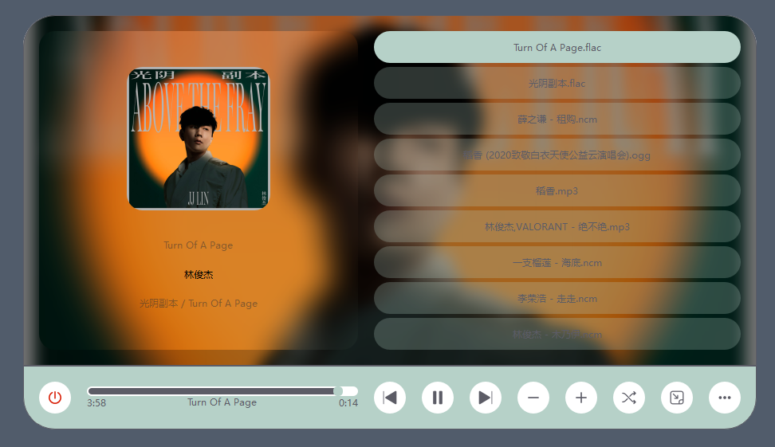

# OnePlayer

#### 介绍
一款界面简洁美观的音乐播放器

#### 软件架构
软件架构说明

#### 安装教程 & 使用说明
1.  QT版本：6.6.0 \(之前使用6.3.2的msvc编译器时，会发生播放音乐卡顿的现象，6.3.2的mingw编译器就没这个问题\)
2.  VS版本：2022 \(用QtCreater的话稍作修改应该也能开发，没试过\)
3.  本项目中还用到了我的另一个项目OneDer，主要用它的DList来代替QList使用。需拉取，并配置包含路径
4.  使用QMediaPlayer的metaData来获取音乐图片，很多时候会获取不到，所以改用FFmpeg来获取音乐图片

#### 分支
1.  dev 开发分支
2.  master 能用的稳定分支

#### 播放器展示

